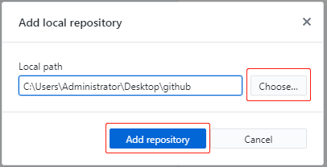

**GitHub 基本操作**
^^^^^^^^^^^^^^^^^^^^^

打开并登录GitHub客户端，可以看到窗口左上角“File”，如下图所示：

.. image:: 1.png

点击“File”，可以进行GitHub的基本操作，如创建新的repository、添加本地repository、克隆repository等。

**Create a new repository**
---------------------------------

1. 点击“File”——“New repository”
#. 命名存储库为：GitHub_Test。
#. 写一个简短的描述：如Just for testing。
#. 选择存储路径：如C:\Users\Administrator\Desktop\github。
#. 用README.md (自述文件)初始化这个存储库。
#. 点击“Create repository”.

**Add local repository**
---------------------------------
该操作是将本地已有的repository文件添加到GitHub客户端。

1. 点击“File”——“Add local repository”。
#. 点击“Choose”选择本地已有的repository文件。
#. 点击“Add repository”。

**Clone a repository**
---------------------------------

1. 点击“File”——“Clone repository”
#. 可看到“GitHub.com”、“Enterprise”、“URL”等选项，较常用的是第一个将GitHub网页版的repository克隆到本地。
#. 点击“GitHub.com”，并在文本框用输入或粘贴想要克隆的网页版GitHub的repository链接。
#. 选择存储路径：如C:\Users\Administrator\Desktop\GitHub_Test。
#. 点击“Clone”。

:author:
    谢晓嫚
		
:date:
    2018/4/24		

